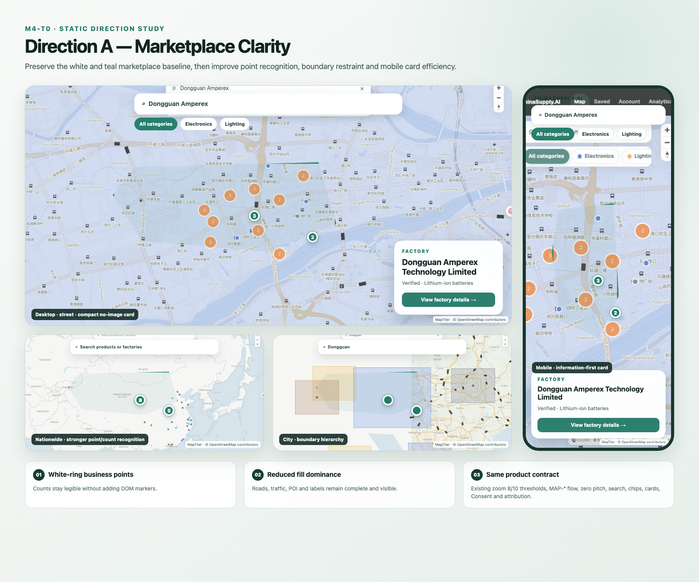
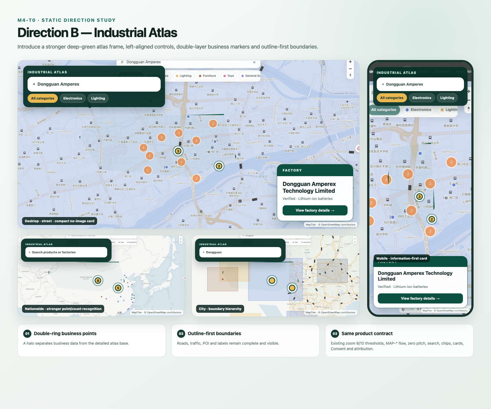

# M4-T0 地图体验诊断与方向冻结

> 状态：**Complete / Owner selected `Keep baseline`**
> 范围：F-1.1～F-1.7、F-11.2、N-1、N-6
> Canonical：`https://staging.chinasupply.ai/`
> 基线数据：2 个公开产业带、6 家公开工厂
> 结论门禁：Owner 已选择 `Keep baseline`，选择原文和 PR 链接已记录，M4-T1 可启动。

## 审阅入口

建议按以下顺序审阅：

1. [现状诊断](diagnosis.md)：问题、影响、PRD 映射和证据编号。
2. [桌面稀疏/密集联系表](assets/density/desktop-sparse-vs-dense.png)与[移动稀疏/密集联系表](assets/density/mobile-sparse-vs-dense.png)：固定视口下的真实基线与 30/200 设计态对照。
3. [方向 A — Marketplace Clarity](assets/directions/direction-a-marketplace-clarity.png)与[方向 B — Industrial Atlas](assets/directions/direction-b-industrial-atlas.png)：两套不扩展 PRD 的静态方向稿。
4. [方向比较](comparison.md)：视觉层级、跨端策略、渲染成本和实现风险。
5. [Owner 决策记录](decision.md)：唯一允许解除 M4-T1 前置门禁的记录入口。

## 任务边界

本目录只包含诊断文档、未标注原始截图、说明性联系表、静态方向稿和设计专用 fixture。本任务没有修改 Web/Mobile 业务代码、共享 MapLibre style JSON、API/schema、生成文件或线上数据。

两套方向均保留：

- zoom `< 8` 的 MAP-1 产业带点、zoom `≥ 8` 的 MAP-2 boundary、zoom `≥ 10` 的 MAP-3 工厂点与 MapLibre cluster；
- 自维护 Streets v4 2D 底图、完整道路/交通/POI、英文名称优先并以当地名称 fallback、零 pitch；
- 现有搜索、一级类目 chips、选择卡片、Consent 和 MapTiler / © OpenStreetMap contributors attribution；
- 现有 MAP-* 数据流、500ms 防抖、abort 与 `map_moved` 十秒节流。

两套方向均不增加热力图、定位、列表抽屉、新 API、外部资源、额外网络请求或 DOM marker。

## 证据包

### 逐项标注

- [桌面现状标注](assets/annotations/desktop-current.png)
- [移动现状标注](assets/annotations/mobile-current.png)

### 未标注 canonical 原始截图

| 场景                            | Desktop 1440×900                                                     | Mobile 390×844                                                      |
| ------------------------------- | -------------------------------------------------------------------- | ------------------------------------------------------------------- |
| 初始中国全境                    | [nationwide](assets/baseline/desktop/nationwide.png)                 | [nationwide](assets/baseline/mobile/nationwide.png)                 |
| Dongguan 产业带搜索后 z9        | [city-z9](assets/baseline/desktop/city-z9.png)                       | [city-z9](assets/baseline/mobile/city-z9.png)                       |
| Dongguan Amperex 工厂搜索后 z13 | [street-z13](assets/baseline/desktop/street-z13.png)                 | [street-z13](assets/baseline/mobile/street-z13.png)                 |
| 街道场景 Consent 打开           | [street-z13-consent](assets/baseline/desktop/street-z13-consent.png) | [street-z13-consent](assets/baseline/mobile/street-z13-consent.png) |

### 未标注密集态截图

| 场景                          | Desktop 1440×900                                  | Mobile 390×844                                   |
| ----------------------------- | ------------------------------------------------- | ------------------------------------------------ |
| 初始中国全境                  | [nationwide](assets/dense/desktop/nationwide.png) | [nationwide](assets/dense/mobile/nationwide.png) |
| Dongguan 城市层级 z9          | [city-z9](assets/dense/desktop/city-z9.png)       | [city-z9](assets/dense/mobile/city-z9.png)       |
| Dongguan Amperex 街道层级 z13 | [street-z13](assets/dense/desktop/street-z13.png) | [street-z13](assets/dense/mobile/street-z13.png) |

## 截图 provenance

- Canonical alias：`https://staging.chinasupply.ai/`
- Vercel deployment：`dpl_9TVpeE8Y1RN7MvgMez8mtTMNuUnm`
- Deployment URL：`https://chinasupply-web-staging-qasjlj348-huangsourcing-2373s-projects.vercel.app`
- 对应 `main` commit：`25f01d01a02f3707dd73a8e1134f1c3a925adc83`
- 固定视口：desktop `1440×900`，mobile `390×844`
- 原始截图未叠加诊断标记，且每张保留 MapTiler 与 © OpenStreetMap contributors attribution。
- 浏览器捕获面返回 JPEG 字节；证据文件在不缩放的前提下规范化为 PNG，再计算最终尺寸、字节数和 SHA-256。
- 每张文件的时间、场景、zoom、数据量、尺寸、字节数和 SHA-256 见 [capture-manifest.json](assets/capture-manifest.json)。

## 密集态 fixture 隔离

[dense-map.fixture.json](fixtures/dense-map.fixture.json) 使用固定种子 `20260727`，提供 30 个产业带点、30 个合法 MultiPolygon boundary 和 200 个工厂点；坐标均为 WGS-84 `[lng, lat]`。ID、名称和几何均为设计专用合成数据，不含凭据或真实个人数据。

密集态截图通过临时浏览器拦截，只替换 canonical 页面发出的 MAP-1/MAP-2/MAP-3 `GET` 响应。fixture 没有接入 seed/import/package scripts，没有向 staging/production 发起写请求，也不构成产品数据源。

密集态 city/street 原图保留规定的搜索词与 zoom，但关闭选择卡片，以完整暴露 boundary 和 factory cluster 密度；卡片与 Consent 的真实重叠关系以 canonical baseline 原图为准。

## Owner 门禁（已通过）

Owner 已在 Draft PR 中明确回复：

- `Keep baseline`

该决定保留当前业务图层、浮层和交互基线。官方 Streets v4 底图快照的修正按 Owner 后续指令在独立 M2-T9 修复中实施，不属于 M4-T0 代码范围。完整选择原文、Owner、日期和 PR 评论链接见 [decision.md](decision.md)。
